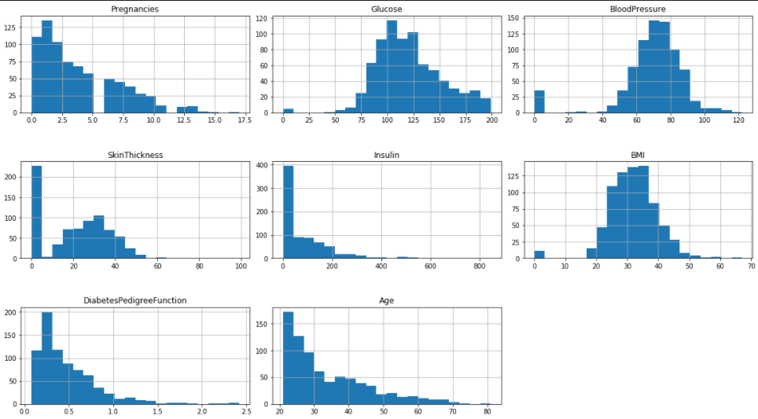

#  Diabetic Prediction Using Machine Learning Techniques

## Introduction

* Diabetes is a very dangerous disease and does not able to cure. If this disease affects once, it will maintain in your 
life time. At the same time, your blood having too much of glucose can cause health issues.

* We are going to build a model that help patients to know whether they have the disease or not  

## Data

* The [dataset](https://www.kaggle.com/datasets/uciml/pima-indians-diabetes-database) used is from the National Institute of Diabetes and Digestive and Kidney Diseases. The objective of the dataset is to diagnostically predict whether or not a patient has diabetes, based on certain diagnostic measurements included in the datase.

* The dataset contains 768 records (row) each has 9 columns as following:

|        Column        |                                     Description                                     |
|:--------------------:|:-----------------------------------------------------------------------------------:|
|    Pregnancies       |                                      Number of times pregnant                       |
|      Glucose         |              Plasma glucose concentration a 2 hours in an oral glucose tolerance test|
|   BloodPressure      |         Diastolic blood pressure (mm Hg)|
|   SkinThickness      |              Triceps skin fold thickness (mm) |
|      Insulin         |                               2-Hour serum insulin (mu U/ml)|
|        BMI           | Body mass index (weight in kg/(height in m)^2)|
|DiabetesPedigreeFunction      |               Diabetes pedigree function|
|        Age           |                  Age (years) |
|     Outcome          | Class variable (0 or 1) 268 of 768 are 1, the others are 0|

## Histograms

## Results
|Model | Accuracy |
|:------------------:|:------------------:|
|K Nearest neighbors: |78.57 %|
|Random Forest:|75.97 %|
|Support Vector Classifier: |73.38 %|
|Naive Bayes: |71.43 %|
|Logistic Regression: | 71.43 %|
|Decision tree:|68.18 %|

## Desktop Application

## Flask Web Application

